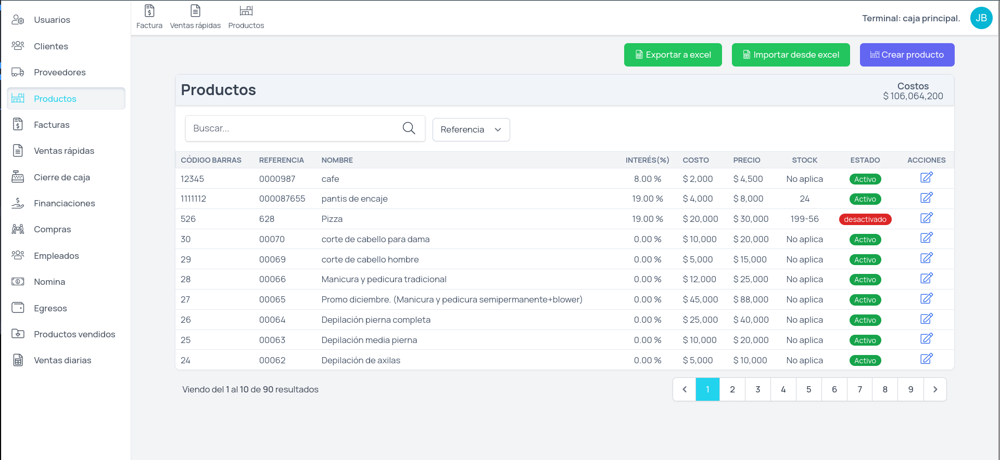

<p align="center">
    <a href="https://aimeos.org/">
        
    </a>
</p>

[Hallpos](https://hallpos.com.co): Agiliza tus ventas, controla tu inventario y obtén informes al instante donde te encuentres. Nuestro sistema POS es fácil de usar y conectar con servicios de facturación electrónica.



Visit [demo](https://test.hallpos.com.co/) page:
- User: admin@gmail.com
- Password: 12345678

## Table Of Content

- [Installation](#installation)
  - [Requirements](#requirements)
  - [Steps](#steps)
- [Deploy](#deploy)
  - [Requirements](#requirements-1)
  - [Steps](#steps-1)

## Installation

### Requirements

| Technology   | Version   |
|--------------|-----------|
|  <p align="center">php</p> | >= 8     |
|  <p align="center">Composer</p> | >= 2 (optional)    |

### Steps


```bash

composer install
# or install from composer.phar file:
php composer.phar install
```

Create .env file, execute this command:

```bash
cp .env-example .env
```

Set database credentials to the following environment variables:

```env
DB_DATABASE=pos-laravel-v2
DB_USERNAME=example
DB_PASSWORD=example
```

After, execute this command:

```bash
npm install
npm run build
php artisan key:generate
php artisan migrate
php artisan migrate:fresh --seed
```


```env
APP_ENV=production
APP_DEBUG=false
APP_URL=<subdomain>
```

Set database credentials to the following environment variables:

```env
DB_DATABASE=example
DB_USERNAME=example
DB_PASSWORD=example
```

After, execute this command:

```bash
php artisan key:generate
php artisan migrate:fresh --seed
php artisan storage:link
cp htaccess .htaccess
chmod 775 -R storage/app/public
```
